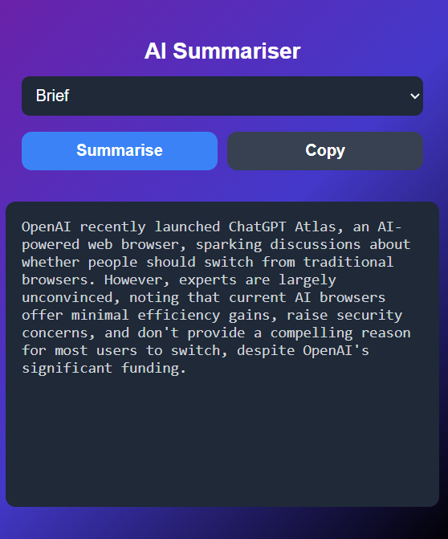

<h1 align="center">ReadLess – AI Webpage Summarizer</h1>

  

  <b>Summarize any webpage instantly — in Brief, Detailed, or Bullet format.</b> 
  Save time, stay informed, and focus on what really matters.

  
  
  

##  What It Does  
 Uses AI to read and understand full webpages, then generates a clean and concise summary in seconds.  
You can choose between **three formats**:

-  **Brief** – short and precise  
-  **Detailed** – complete explanation with context  
-  **Bullet** – key takeaways in list form  

---
